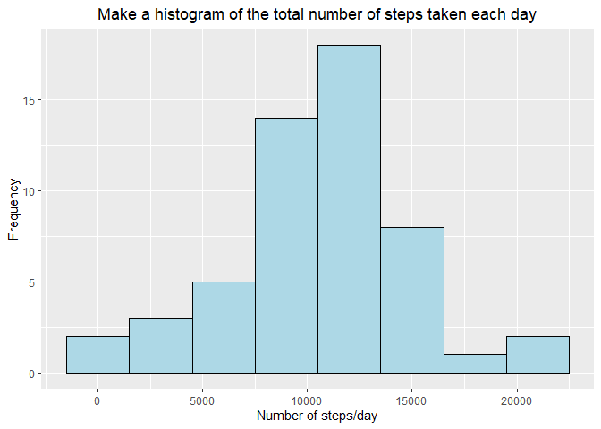
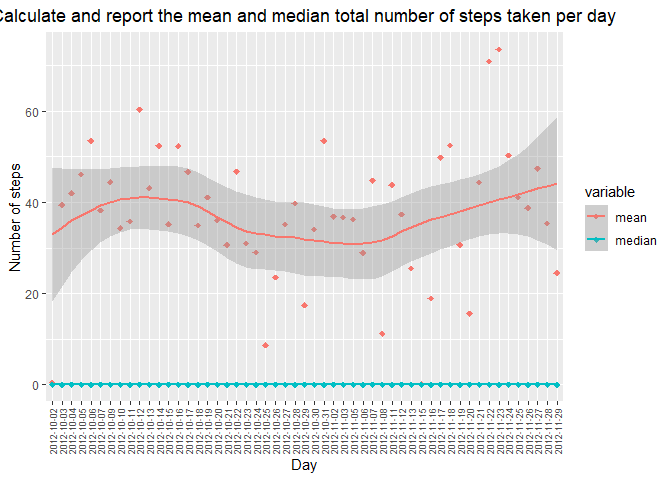
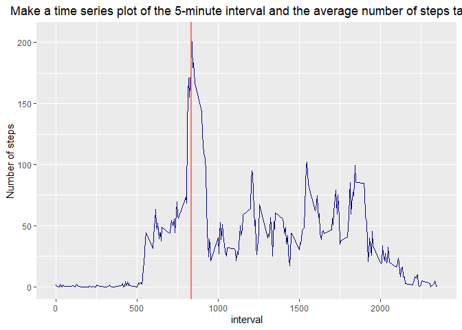
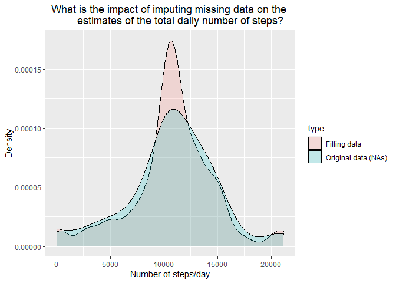
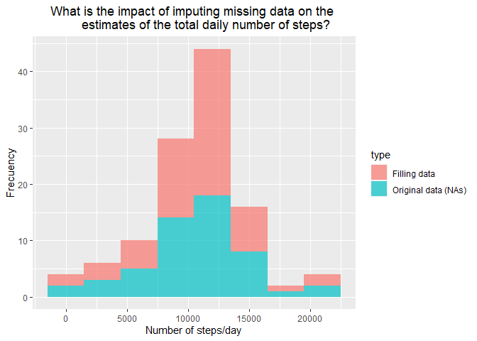
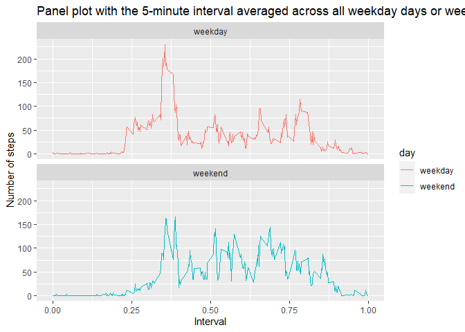

```r
library(ggplot2)
library(reshape2)
library(lattice)
library(chron)
```


## Loading and preprocessing the data

**All figures includes in HTML file!**


```r
unzip("activity.zip")
data <- read.csv("activity.csv", colClasses=c(NA,"Date","integer"), na.strings = "NA")
```


## What is mean total number of steps taken per day?
For this part of the assignment, you can ignore the missing values in the dataset.
1. Make a histogram of the total number of steps taken each day


```r
steps.day <- tapply(data$steps, data$date, sum)
mean.day <- tapply(data$steps, data$date, mean)
median.day <- tapply(data$steps, data$date, median, na.rm = TRUE)

stats.day <- cbind(data.frame(steps = steps.day[complete.cases(steps.day)]),
                   data.frame(mean = mean.day[complete.cases(mean.day)]),
                   data.frame(median = median.day[complete.cases(median.day)]))

ggplot(stats.day, aes(x=steps)) +  geom_histogram(colour="black", fill="lightblue", binwidth=3000) + labs(title = "Make a histogram of the total number of steps taken each day", x="Number of steps/day", y="Frequency") + theme(plot.title = element_text(hjust = 0.5)) 
```

<!-- -->

2. Calculate and report the mean and median total number of steps taken
per day


```r
stats.day$date <- row.names(stats.day)
stats.long <- melt(stats.day, date = "date", measure.vars = c("mean","median"))

ggplot(stats.long, aes(date, value, colour = variable, group=variable))  + labs(title = "Calculate and report the mean and median total number of steps taken per day", x="Day", y="Number of steps") + theme(plot.title = element_text(hjust = 0.5), axis.text.x = element_text(angle = 90, vjust =0.5, hjust=1, size = 7))  +  geom_point(pch = 18, size = 2) + geom_smooth(size=1)
```

```
## `geom_smooth()` using method = 'loess' and formula 'y ~ x'
```

<!-- -->

```r
#list
stats.day[,-4]
```

```
##            steps       mean median
## 2012-10-02   126  0.4375000      0
## 2012-10-03 11352 39.4166667      0
## 2012-10-04 12116 42.0694444      0
## 2012-10-05 13294 46.1597222      0
## 2012-10-06 15420 53.5416667      0
## 2012-10-07 11015 38.2465278      0
## 2012-10-09 12811 44.4826389      0
## 2012-10-10  9900 34.3750000      0
## 2012-10-11 10304 35.7777778      0
## 2012-10-12 17382 60.3541667      0
## 2012-10-13 12426 43.1458333      0
## 2012-10-14 15098 52.4236111      0
## 2012-10-15 10139 35.2048611      0
## 2012-10-16 15084 52.3750000      0
## 2012-10-17 13452 46.7083333      0
## 2012-10-18 10056 34.9166667      0
## 2012-10-19 11829 41.0729167      0
## 2012-10-20 10395 36.0937500      0
## 2012-10-21  8821 30.6284722      0
## 2012-10-22 13460 46.7361111      0
## 2012-10-23  8918 30.9652778      0
## 2012-10-24  8355 29.0104167      0
## 2012-10-25  2492  8.6527778      0
## 2012-10-26  6778 23.5347222      0
## 2012-10-27 10119 35.1354167      0
## 2012-10-28 11458 39.7847222      0
## 2012-10-29  5018 17.4236111      0
## 2012-10-30  9819 34.0937500      0
## 2012-10-31 15414 53.5208333      0
## 2012-11-02 10600 36.8055556      0
## 2012-11-03 10571 36.7048611      0
## 2012-11-05 10439 36.2465278      0
## 2012-11-06  8334 28.9375000      0
## 2012-11-07 12883 44.7326389      0
## 2012-11-08  3219 11.1770833      0
## 2012-11-11 12608 43.7777778      0
## 2012-11-12 10765 37.3784722      0
## 2012-11-13  7336 25.4722222      0
## 2012-11-15    41  0.1423611      0
## 2012-11-16  5441 18.8923611      0
## 2012-11-17 14339 49.7881944      0
## 2012-11-18 15110 52.4652778      0
## 2012-11-19  8841 30.6979167      0
## 2012-11-20  4472 15.5277778      0
## 2012-11-21 12787 44.3993056      0
## 2012-11-22 20427 70.9270833      0
## 2012-11-23 21194 73.5902778      0
## 2012-11-24 14478 50.2708333      0
## 2012-11-25 11834 41.0902778      0
## 2012-11-26 11162 38.7569444      0
## 2012-11-27 13646 47.3819444      0
## 2012-11-28 10183 35.3576389      0
## 2012-11-29  7047 24.4687500      0
```


## What is the average daily activity pattern?

1. Make a time series plot (i.e. `type = "l"`) of the 5-minute interval (x-axis) and the average number of steps taken, averaged across all days (y-axis)


```r
mean.interval <- data.frame(steps = tapply(data$steps, data$interval, mean, na.rm = TRUE))
mean.interval$interval <- as.numeric(row.names(mean.interval))

ggplot(mean.interval, aes(interval, steps)) + geom_line(lwd = .5, col="darkblue") +
  labs(title = "Make a time series plot of the 5-minute interval and the average number of steps taken", y="Number of steps") + theme(plot.title = element_text(hjust = 0.5)) + geom_vline(aes(xintercept=interval[steps == max(steps)],color='Mean'), show.legend = FALSE, size=1) 
```

<!-- -->

2. Which 5-minute interval, on average across all the days in the dataset, contains the maximum number of steps?


```r
# max interval
mean.interval$interval[which.max(mean.interval$steps)]
```

```
## [1] 835
```

```r
# max value
max(mean.interval$steps)
```

```
## [1] 206.1698
```


## Imputing missing values

1. Calculate and report the total number of missing values in the dataset (i.e. the total number of rows with `NA`s)


```r
# NAs number
sum(is.na(data$steps))
```

```
## [1] 2304
```

2. Devise a strategy for filling in all of the missing values in the dataset. The strategy does not need to be sophisticated. For example, you could use the mean/median for that day, or the mean for that 5-minute interval, etc.


```r
head(table(data[is.na(data$steps),3]), 100)
```

```
## 
##   0   5  10  15  20  25  30  35  40  45  50  55 100 105 110 115 120 125 130 135 
##   8   8   8   8   8   8   8   8   8   8   8   8   8   8   8   8   8   8   8   8 
## 140 145 150 155 200 205 210 215 220 225 230 235 240 245 250 255 300 305 310 315 
##   8   8   8   8   8   8   8   8   8   8   8   8   8   8   8   8   8   8   8   8 
## 320 325 330 335 340 345 350 355 400 405 410 415 420 425 430 435 440 445 450 455 
##   8   8   8   8   8   8   8   8   8   8   8   8   8   8   8   8   8   8   8   8 
## 500 505 510 515 520 525 530 535 540 545 550 555 600 605 610 615 620 625 630 635 
##   8   8   8   8   8   8   8   8   8   8   8   8   8   8   8   8   8   8   8   8 
## 640 645 650 655 700 705 710 715 720 725 730 735 740 745 750 755 800 805 810 815 
##   8   8   8   8   8   8   8   8   8   8   8   8   8   8   8   8   8   8   8   8
```

```r
table(data[is.na(data$steps),2])
```

```
## 
## 2012-10-01 2012-10-08 2012-11-01 2012-11-04 2012-11-09 2012-11-10 2012-11-14 
##        288        288        288        288        288        288        288 
## 2012-11-30 
##        288
```

```r
head(mean.interval)
```

```
##        steps interval
## 0  1.7169811        0
## 5  0.3396226        5
## 10 0.1320755       10
## 15 0.1509434       15
## 20 0.0754717       20
## 25 2.0943396       25
```

```r
# tapply(data$steps, data$interval, mean, na.rm = TRUE)
```


3. Create a new dataset that is equal to the original dataset but with the missing data filled in.


```r
index <- which(is.na(data$steps))
data.total <- data

for (i in 1:sum(is.na(data$steps))){
  j <- which(data[index[i],3] == mean.interval$interval)
  data.total[index[i],1] <- mean.interval$steps[j]
}

# NAs number
sum(is.na(data.total$steps))
```

```
## [1] 0
```


4. Make a histogram of the total number of steps taken each day and Calculate and report the **mean** and **median** total number of steps taken per day. Do these values differ from the estimates from the first part of the assignment? What is the impact of imputing missing data on the estimates of the total daily number of steps?


```r
steps.total.day <- tapply(data.total$steps, data.total$date, sum)
mean.total.day <- tapply(data.total$steps, data.total$date, mean)
median.total.day <- tapply(data.total$steps, data.total$date, median)

stats.total.day <- cbind(data.frame(steps = steps.total.day),
                   data.frame(mean = mean.total.day),
                   data.frame(median = median.total.day))

stats.total.day
```

```
##               steps       mean   median
## 2012-10-01 10766.19 37.3825996 34.11321
## 2012-10-02   126.00  0.4375000  0.00000
## 2012-10-03 11352.00 39.4166667  0.00000
## 2012-10-04 12116.00 42.0694444  0.00000
## 2012-10-05 13294.00 46.1597222  0.00000
## 2012-10-06 15420.00 53.5416667  0.00000
## 2012-10-07 11015.00 38.2465278  0.00000
## 2012-10-08 10766.19 37.3825996 34.11321
## 2012-10-09 12811.00 44.4826389  0.00000
## 2012-10-10  9900.00 34.3750000  0.00000
## 2012-10-11 10304.00 35.7777778  0.00000
## 2012-10-12 17382.00 60.3541667  0.00000
## 2012-10-13 12426.00 43.1458333  0.00000
## 2012-10-14 15098.00 52.4236111  0.00000
## 2012-10-15 10139.00 35.2048611  0.00000
## 2012-10-16 15084.00 52.3750000  0.00000
## 2012-10-17 13452.00 46.7083333  0.00000
## 2012-10-18 10056.00 34.9166667  0.00000
## 2012-10-19 11829.00 41.0729167  0.00000
## 2012-10-20 10395.00 36.0937500  0.00000
## 2012-10-21  8821.00 30.6284722  0.00000
## 2012-10-22 13460.00 46.7361111  0.00000
## 2012-10-23  8918.00 30.9652778  0.00000
## 2012-10-24  8355.00 29.0104167  0.00000
## 2012-10-25  2492.00  8.6527778  0.00000
## 2012-10-26  6778.00 23.5347222  0.00000
## 2012-10-27 10119.00 35.1354167  0.00000
## 2012-10-28 11458.00 39.7847222  0.00000
## 2012-10-29  5018.00 17.4236111  0.00000
## 2012-10-30  9819.00 34.0937500  0.00000
## 2012-10-31 15414.00 53.5208333  0.00000
## 2012-11-01 10766.19 37.3825996 34.11321
## 2012-11-02 10600.00 36.8055556  0.00000
## 2012-11-03 10571.00 36.7048611  0.00000
## 2012-11-04 10766.19 37.3825996 34.11321
## 2012-11-05 10439.00 36.2465278  0.00000
## 2012-11-06  8334.00 28.9375000  0.00000
## 2012-11-07 12883.00 44.7326389  0.00000
## 2012-11-08  3219.00 11.1770833  0.00000
## 2012-11-09 10766.19 37.3825996 34.11321
## 2012-11-10 10766.19 37.3825996 34.11321
## 2012-11-11 12608.00 43.7777778  0.00000
## 2012-11-12 10765.00 37.3784722  0.00000
## 2012-11-13  7336.00 25.4722222  0.00000
## 2012-11-14 10766.19 37.3825996 34.11321
## 2012-11-15    41.00  0.1423611  0.00000
## 2012-11-16  5441.00 18.8923611  0.00000
## 2012-11-17 14339.00 49.7881944  0.00000
## 2012-11-18 15110.00 52.4652778  0.00000
## 2012-11-19  8841.00 30.6979167  0.00000
## 2012-11-20  4472.00 15.5277778  0.00000
## 2012-11-21 12787.00 44.3993056  0.00000
## 2012-11-22 20427.00 70.9270833  0.00000
## 2012-11-23 21194.00 73.5902778  0.00000
## 2012-11-24 14478.00 50.2708333  0.00000
## 2012-11-25 11834.00 41.0902778  0.00000
## 2012-11-26 11162.00 38.7569444  0.00000
## 2012-11-27 13646.00 47.3819444  0.00000
## 2012-11-28 10183.00 35.3576389  0.00000
## 2012-11-29  7047.00 24.4687500  0.00000
## 2012-11-30 10766.19 37.3825996 34.11321
```

```r
stats.total.day$date <- row.names(stats.total.day)


stats.day$type <- 'Original data (NAs)'
stats.total.day$type <- 'Filling data'
comparation <- rbind(stats.day, stats.total.day)

ggplot(comparation, aes(steps, fill = type)) + geom_density(alpha = 0.2) + 
  labs(title = "What is the impact of imputing missing data on the 
       estimates of the total daily number of steps?", x="Number of steps/day", y="Density") + theme(plot.title = element_text(hjust = 0.5)) 
```

<!-- -->

```r
ggplot(comparation, aes(steps, fill = type)) + geom_histogram(alpha = 0.7, binwidth=3000) + 
  labs(title = "What is the impact of imputing missing data on the 
       estimates of the total daily number of steps?", x="Number of steps/day", y="Frecuency") + theme(plot.title = element_text(hjust = 0.5)) 
```

<!-- -->


## Are there differences in activity patterns between weekdays and weekends?

For this part the `weekdays()` function may be of some help here. Use
the dataset with the filled-in missing values for this part.

1. Create a new factor variable in the dataset with two levels -- "weekday" and "weekend" indicating whether a given date is a weekday or weekend day.


```r
data.total$weekday <- factor((weekdays(data.total$date, abbreviate = TRUE) %in% c("sáb.","dom.")), levels=c(TRUE, FALSE), labels=c('weekend', 'weekday'))

table(data.total$weekday)
```

```
## 
## weekend weekday 
##    4608   12960
```


1. Make a panel plot containing a time series plot (i.e. `type = "l"`) of the 5-minute interval (x-axis) and the average number of steps taken, averaged across all weekday days or weekend days (y-axis). The plot should look something like the following, which was created using **simulated data**


```r
data.weekday <- data.total[data.total$weekday=="weekday",]
weekday <- data.frame(steps.mean = tapply(data.weekday$steps, data.weekday$interval, mean))
weekday$interval <- times(as.numeric(rownames(weekday)))/(2355)
weekday$day <- "weekday"

data.weekend <- data.total[data.total$weekday=="weekend",]
weekend <- data.frame(steps.mean = tapply(data.weekend$steps, data.weekend$interval, mean))
weekend$interval <- times(as.numeric(rownames(weekend)))/(2355)
weekend$day <- "weekend"


panel.data <- rbind(weekday,weekend)

ggplot(panel.data) + facet_wrap(day~., ncol = 1) + geom_line(aes(interval, steps.mean, color = day)) + labs(title = "Panel plot with the 5-minute interval averaged across all weekday days or weekend days", x="Interval", y="Number of steps") + scale_x_continuous()
```

<!-- -->

